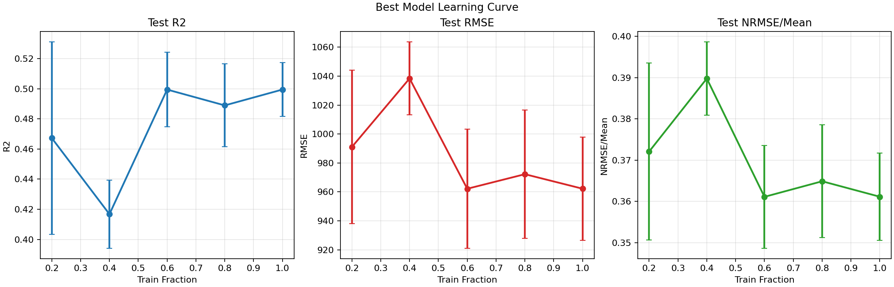

# Experiment Manifest

Date: March 2, 2026  
Repository: `paddy-yield-ml-enterprise`  
Manifest scope: current CAROB production path

## 1) Objective
Deliver a decision-support workflow with:
- governed feature roles (modifiable/context/proxy),
- trial-aware predictive evaluation,
- interpretable rule extraction tied to model behavior,
- and rule-as-treatment causal diagnostics with explicit caveats.

## 2) Data Contract
- Input dataset: `data/input/carob_amazxa.csv`
- Data dictionary: `data/metadata/data_dictionary_carob_amazxa.csv`
- Metadata: `data/metadata/carob_amazxa_meta.csv`
- Target: `yield`
- Grouping key: `trial_id`
- Note: causal pipeline uses **rule-as-treatment** derived from interpretability outputs, not raw treatment labels.

## 3) Feature-Prepare Contract
Pipeline: `src/paddy_yield_ml/pipelines/carob_feature_prepare.py`  
Runner: `scripts/run_carob_feature_prepare.py`

### 3.1 Gates and Policy
- Proxy policy: `preserve_role`
- Country constancy gate: enabled (`threshold=0.8`, `min_rows=20`)
- Trial full-missing soil gate: enabled (`soil_P`, `soil_pH`)

### 3.2 Modeling Population
- Rows raw: `1202`
- Rows after country gate: `1108`
- Rows after trial gate: `830`
- Countries: `8 -> 6`
- Trials: `19 -> 17 -> 13`

### 3.3 Feature Status Summary
- `candidate_modifiable=7`
- `reserve_context=10`
- `excluded=10`

Sources:
- `outputs/carob_feature_prepare/modeling_population_summary.csv`
- `outputs/carob_feature_prepare/hybrid_selection_candidates.csv`

## 4) Model Compare Contract
Pipeline: `src/paddy_yield_ml/pipelines/carob_model_compare.py`  
Runner: `scripts/run_carob_model_compare.py`

### 4.1 Evaluation Settings
- Scenario: `modifiable_plus_context`
- Features used: `17`
- Split: trial-aware train/validation/test (`507 / 163 / 160`)
- Models compared: RandomForest, ExtraTrees, CatBoost, XGBoost, LightGBM

### 4.2 Best Model (Model Compare)
- Model: `ExtraTrees`
- Test metrics: `R2=0.5160`, `RMSE=966.01`, `MAE=733.14`
- Test trials represented: `13`

Sources:
- `outputs/carob_model_compare/model_comparison_summary.csv`
- `outputs/carob_model_compare/train_validate_test_split_summary.csv`

## 5) Top-2 Tuning Contract
Pipeline: `src/paddy_yield_ml/pipelines/carob_model_tune_top2.py`  
Runner: `scripts/run_carob_model_tune_top2.py`

### 5.1 Current Outcome (Locked Test)
- `ExtraTrees`: `test_R2=0.4792`, `test_RMSE=1002.02`, `test_MAE=749.09`
- `CatBoost`: `test_R2=0.4792`, `test_RMSE=1002.08`, `test_MAE=740.98`

Operational note:
- Model metrics from carob_model_compare and carob_model_tune_top2 are not directly apples-to-apples because the
  objective changed: model_compare selects params on a single validation split (seed 42), while model_tune_top2 selects
  configs by validation stability across multiple seeds (42/52/62) and then reports locked-test performance; tuning also
  used a different sampled search space (including explicit max_features options), so a lower seed-42 test score can
  occur even when the selected config is more robust overall.
- Models are effectively tied on locked test; `ExtraTrees` is used as primary for alignment with explainability stack.

### 5.2 Learning Curve Investigation (Best Model Only)
Purpose:
- Check whether additional rows alone are likely to improve performance.

Setup:
- Model: `ExtraTrees` (selected winner from top-2 tuning).
- Split policy: same trial-aware train/validation/test logic as tuning.
- Train fractions evaluated: `0.2, 0.4, 0.6, 0.8, 1.0`.
- Seeds: `3` (same stability seed set unless overridden).

Key results (test-set means across seeds):
- `0.2`: `R2=0.4673`, `RMSE=991.04`, `NRMSE/mean=0.3721`
- `0.4`: `R2=0.4167`, `RMSE=1038.38`, `NRMSE/mean=0.3898`
- `0.6`: `R2=0.4995`, `RMSE=962.15`, `NRMSE/mean=0.3611`
- `0.8`: `R2=0.4889`, `RMSE=972.22`, `NRMSE/mean=0.3649`
- `1.0`: `R2=0.4995`, `RMSE=962.18`, `NRMSE/mean=0.3611`

Interpretation:
- Performance improves from very small sample sizes but plateaus around `0.6+`.
- This suggests diminishing returns from adding more rows of the same data type.
- Next gains likely require better context signal (feature quality/coverage), not only more instances.

Artifacts:
- `outputs/carob_model_tune_top2/learning_curve_best_model_metrics.csv`
- `outputs/carob_model_tune_top2/learning_curve_best_model_summary.csv`
- `outputs/carob_model_tune_top2/learning_curve_best_model.png`

Plot:


Sources:
- `outputs/carob_model_tune_top2/model_winners.csv`
- `outputs/carob_model_tune_top2/learning_curve_best_model_summary.csv`

## 6) Interpretability Contract (Current)
Pipeline: `src/paddy_yield_ml/pipelines/carob_interpretability.py`  
Runner: `scripts/run_carob_interpretability.py`  
Run tag: `iter5_extratrees_shap_only_v1`

### 6.1 Explainability Mode
- Primary model: `extratrees`
- SHAP mode: `extratrees_treeshap` (same model family as predictor)

### 6.2 Key Outputs in Use
- Iteration-1 test metrics: `R2=0.4722`, `RMSE=1008.75`, `MAE=754.17`
- Final rules: `5`
- SHAP-permutation top-10 overlap: `0.90`
- Rule-country status counts:
  - `works_here=4`
  - `unstable_or_small_effect=4`
  - `conflicts_here=1`
  - `insufficient_evidence=16`

Sources:
- `outputs/carob_interpretability/iter5_extratrees_shap_only_v1/interpretability_runlog.txt`
- `outputs/carob_interpretability/iter5_extratrees_shap_only_v1/iteration3_rules_final.csv`
- `outputs/carob_interpretability/iter5_extratrees_shap_only_v1/iteration3_rule_country_generalization.csv`

## 7) Rule-Causal Contract (AIPW)
Pipeline: `src/paddy_yield_ml/pipelines/carob_rule_causal_aipw.py`  
Runner: `scripts/run_carob_rule_causal_aipw.py`  
Run tag: `rule_aipw_v4_extratrees_shap_only`

### 7.1 Recommendation Summary
- Scorecard rows: `6`
- Ready pairs: `6`
- Pair-seed estimates: `18`
- Recommendations:
  - `Pilot-only=4`
  - `Do-not-recommend=2`
  - `Recommend=0`

### 7.2 Provenance Gate
- Causal pipeline expects interpretability artifacts from ExtraTrees SHAP-only mode by default.

Sources:
- `outputs/carob_rule_causal_aipw/rule_aipw_v4_extratrees_shap_only/causal_rule_scorecard.csv`
- `outputs/carob_rule_causal_aipw/rule_aipw_v4_extratrees_shap_only/causal_runlog.txt`

## 8) Reproducibility Commands
Run in this order from repo root:

```powershell
uv run python scripts/run_carob_feature_prepare.py
uv run python scripts/run_carob_model_compare.py
uv run python scripts/run_carob_model_tune_top2.py
uv run python scripts/run_carob_interpretability.py --run-tag iter5_extratrees_shap_only_v1
uv run python scripts/run_carob_rule_causal_aipw.py --run-tag rule_aipw_v4_extratrees_shap_only --interp-dir outputs/carob_interpretability/iter5_extratrees_shap_only_v1
```

## 9) Known Limits
- Causal outputs are assumption-based and should not be framed as policy-grade guarantees.
- Most rule-country pairs remain non-recommendation (`Pilot-only` or `Do-not-recommend`) due to overlap/balance/diversity constraints.
- Outputs are run-tagged; always cite exact run folders when presenting results.
